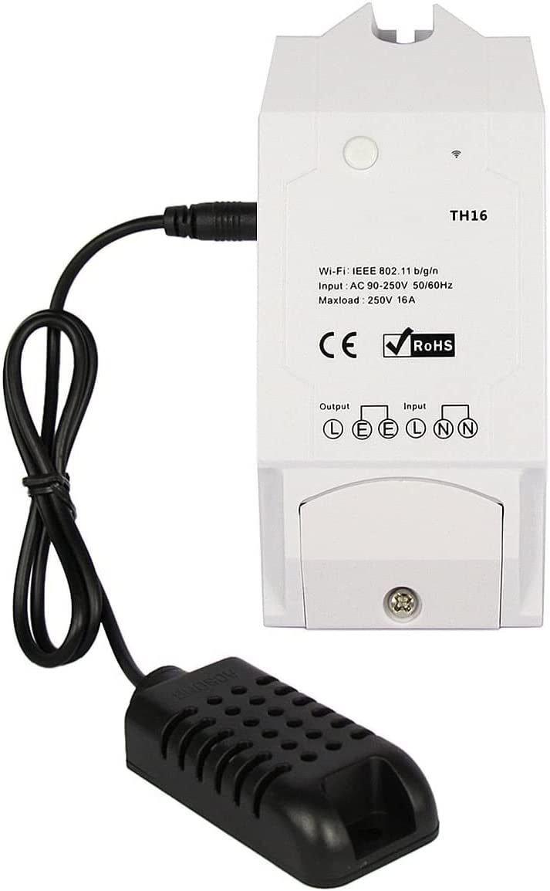

Sming Switch
============

.. highlight:: bash

An alternative firmaware for `SONOFF - TH10/TH16 switches <https://sonoff.tech/product/diy-smart-switch/th10-th16/>`_ 
based on `Sming Framework <https://github.com/SmingHub/Sming>`_. 

Introduction
------------

TBD...

Features
--------

SmartConfig Support
~~~~~~~~~~~~~~~~~~~

By pressing the button for a long time the device will enter a configuration mode.
Using `smartconfig <https://sming.readthedocs.io/en/latest/_inc/samples/Basic_SmartConfig/index.html>`_ one can easier provide 
WIFI credentials without having to flash new firmware. 

Automatic Over-The-Air(OTA) updates
~~~~~~~~~~~~~~~~~~~~~~~~~~~~~~~~~~~

The application will be updated automatically when there is a new version. 
This is done via a secure connection to a MQTT server. 
If interested you can easily change the MQTT server with your own one.
For more details see the `OtaUpgradeMqtt <https://sming.readthedocs.io/en/latest/_inc/Sming/Libraries/OtaUpgradeMqtt/index.html>`_ documentation.

Automatic start when humidity is increasing
~~~~~~~~~~~~~~~~~~~~~~~~~~~~~~~~~~~~~~~~~~~

UPnP Support
~~~~~~~~~~~~

`Universal Plug and Play (UPnP) <https://sming.readthedocs.io/en/latest/_inc/Sming/Libraries/UPnP/about.html>`_ is a set of networking protocols that permits networked devices, such as personal computers, printers, 
Internet gateways, Wi-Fi access points and mobile devices to seamlessly discover each other’s presence on the network and establish 
functional network services for data sharing, communications, and entertainment.

Getting Started
---------------

Requirements
~~~~~~~~~~~~

This application is based on Sming Framework. You will need to install at least the Esp8266 toolchain for your operating system.
Take a look at `Sming's documentation <https://sming.readthedocs.io/en/latest/getting-started/index.html>`_ for details. 

Compilation
~~~~~~~~~~~

Once ready with the Sming installation you need to go to the root folder of this project and run::

  make
  
The command above will compile Sming and your application. The initial compilation takes a bit of time so be patient.

Wiring
~~~~~~

.. warning::
	DANGER OF ELECTROCUTION

	If your device connects to mains electricity (AC power) there is danger of electrocution if not installed properly. 
	If you don't know how to install it, please call an electrician (Beware: certain countries prohibit installation without a licensed electrician present). 
	Remember: SAFETY FIRST. It is not worth the risk to yourself, your family and your home if you don't know exactly what you are doing. 
	Never tinker or try to flash a device using the serial programming interface while it is connected to MAINS ELECTRICITY (AC power).

	We don't take any responsibility nor liability for using this software nor for the installation or any tips, advice, 
	videos, etc. given by any member of this site or any related site. 

TBD ...

Flashing
~~~~~~~~

.. warning::
	DANGER OF ELECTROCUTION

	For this step your device MUST be disconnected from mains electricity (AC power).
	Never tinker or try to flash a device using the serial programming interface while it is connected to MAINS ELECTRICITY (AC power).
	We don't take any responsibility nor liability for using this software nor for the installation or any tips, advice, 
	videos, etc. given by any member of this site or any related site. 

Make sure that you have the correct wiring. Connect your device to your laptop.
From your laptop run the following command from the root application folder::

	make flash

